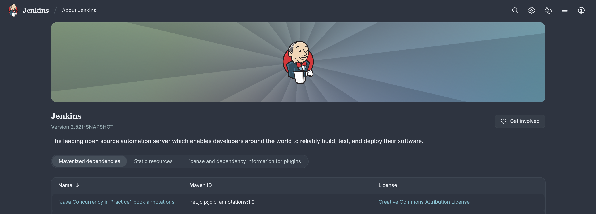

# Nord Theme Plugin

## Introduction

_A clear, uncluttered, and elegant design to achieve undisturbed focus and excellent readability._

This plugin provides the [Nord theme](https://www.nordtheme.com) for Jenkins.

## Usage

After installing this plugin, go to _Manage Jenkins » Appearance » Themes_ and select the _Nord_ theme.

## Contributing

Refer to our [contribution guidelines](https://github.com/jenkinsci/.github/blob/master/CONTRIBUTING.md).

## LICENSE

Licensed under MIT, see [LICENSE](LICENSE.md).
